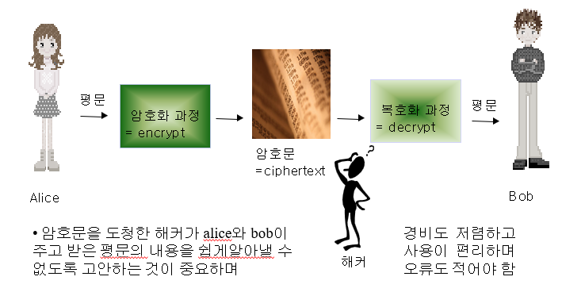
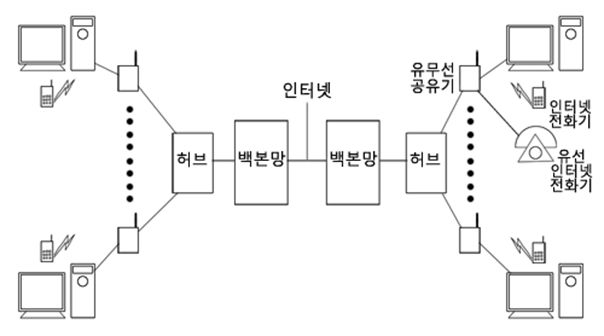
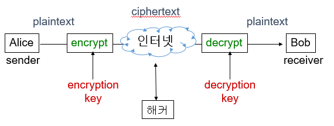
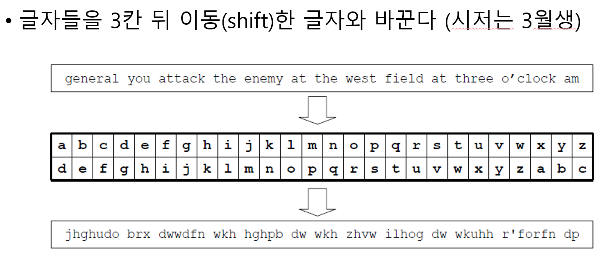
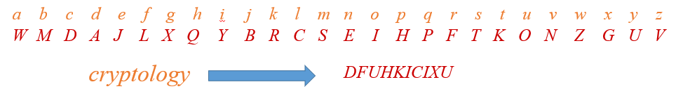
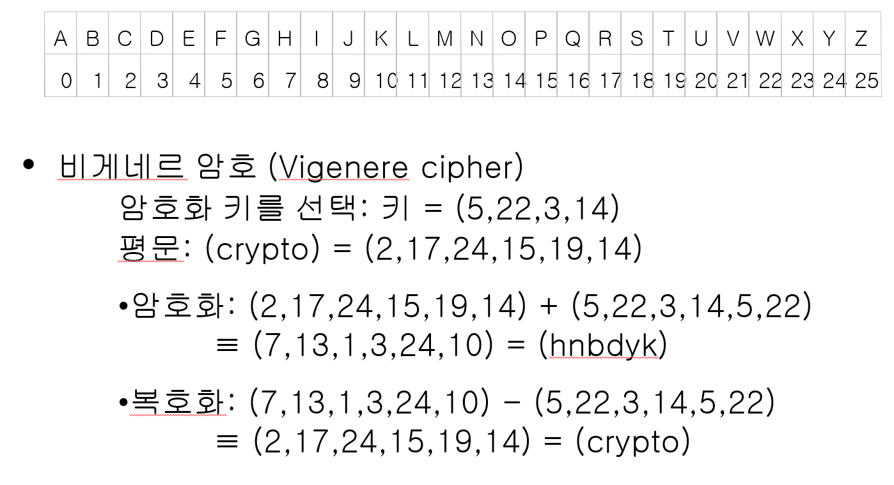

# Introduction to Cryptography

## Cryptography란?

- cryptography = 암호 작성
- cryptoanalysis = 해킹학
- cryptology = both

## insecure한 network medium에서 어떻게 confientiality, integrity 등을 제공할까?

- confidentiality: 기밀성(비밀성), 허가된 사용자, 장비만이 data 내용을 알 수 있도록 함, 주요 공격(eavesdrop, interception), 해결(encrypt, decrypt)

### 암호(encrypt, decrypt)란?

- 암호(cryptography)
- 비밀정보의 교환을 위해 생겨남
- 암호 체계의 효용성 및 안전성 분석: 고급 수학 이론에 기반

### 암호 개념도

- 카톡, 배민, 쿠팡 등 모든 인터넷의 기본
  

### 용어 및 등장인물

- Internet은 공개망이다 -> insecure communication
  

- 등장인물: Alice, Bob, hacker

- 평문(plain): 암호화 전 문장
- 암호문(ciphertext): 암호화된 문장
- 암호화(encryption): 평문을 암호문으로 바꾸는 과정
- 복호화(decryption): 암호문을 평문으로 바꾸는 과정
- 암호 알고리즘: 암호화 알고리즘과 복호화 알고리즘
- 키(key): 암호 알고리즘에 사용되는 정보
  

### shift cipher



`(x+3) mod 26`

```
def encrypt(text, key):
  result = ""
  # transverse the plain text
  for i in range(len(text)):
      char = text[i]
      if (char.insupper()):
          result += chr((ord(char) + key - 65) % 26 + 65)
      else:
          result += char((ord(char) + key - 97) % 26 + 97)

  msg = input("plaintext: ")
  key = input("key: ")

  ciphertext = encrypt(msg, int(key))
  print(ciphertext)
```

- 해독

```
  LETTERS = "abcdefghijklmnopqrstuvwxyz"

  for key in range(len(LETTERS)):
      translated = ""
      for symbol in ciphertext:
          if symbol in LETTERS:
              num = LETTERS.find(symbol)
              num = num - key
              if num < 0:
              num = num + len(LETTERS)
              translated = translated + LETTERS[num]
          else:
              translated = translated + symbol
      print("Hacking key #%s: %s" % (key, translated))
```

### substitution cipher

- 각 글자를 다른 글자로 대치
  

- 키 space는 26! (약 $4 \times 10^{26}$)
- 초당 $10^{10}$개 키, 계산해도 $10^{11}$년 소요

```
alphabet = "abcdefghijklmnopqrstuvwxyz"
key = "fcpevqkzgmtrayonujdlwhbxsi"

def encrypt(text, key):
    result = ""
    for letter in text:
        if letter.lower() in alphabet:
            result += key[alphabet.find(letter.lower())]
        else:
            result += letter
    return(result)

msg = input("plaintext: ")
print(incrypt(msg, key))
```

- 해독
  $C_i = (P_i + K_i) \mod 26$,
  $P_i = (C_i - K_i + 26) \mod 26$

  - 키가 없는 경우 (암호문만 있는 경우)
    - Kasiski 분석, Friedman test 같은 기법으로 키 길이 추측
    - 빈도분석(Frequency analysis)으로 키를 유추해 해독합니다.

### vigenere cipher



- shift, substitute는 같은 문자는 같은 문자로 치환
- 예를들어, school에서 oo는 같은 문자인 aa, bb, cc, ... 로 치환됨
- 그러나 vigenere는 oo가 rp, dq등으로 치환될 수 있음
- se도 ee로 치환될 수 있음
- 그렇담 vigenere의 key는 같은 문자가 없는 단어가 좋을까?
