# Symmetric Key Cipher

## 현대 암호의 분류

(이번 학기 배울 내용 전체)

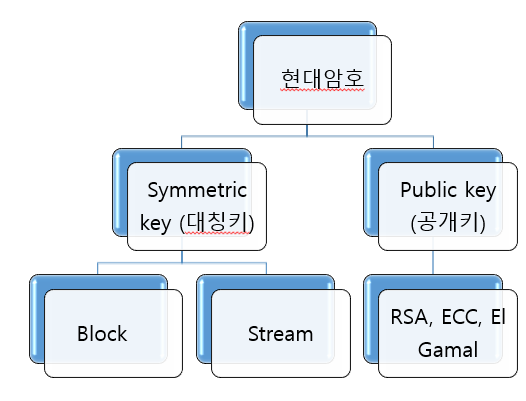

- 현대 암호는 symmetric key와 public key로 나뉜다.
- symmetric key와 public key의 개념!
- symmetric key와 public key의 장단점!

## symmetric key vs. public key

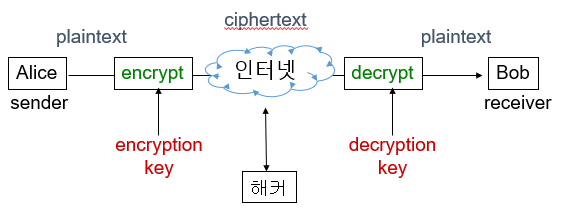

- symmetric: 좌우 대칭적인, 나와 상대방이 같은 것

- encryption key와 decryption key 동일 여부
- 같으면 symmetric key, 다르면 public key

## symmetric key 암호 체계

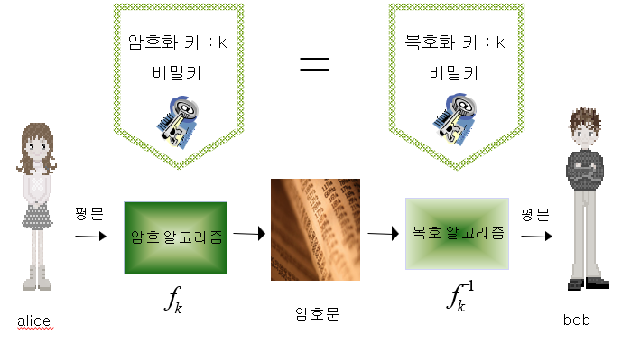

### symmetric

- 암호화 키와 복호화 키가 같은 것
- 보내는 사람과 받는 사람이 같은 키를 사용함

## public key 암호 체계


### public

- 암호화 키와 복호화 키가 다른 것
- 보내는 사람과 받는 사람이 다른 키를 사용함

## Sense Test

Q) shift, affine, substitution, vigenere cipher는 symmetric인가 public인가?

A) symmetric!!

## block cipher vs. stream cipher

### block

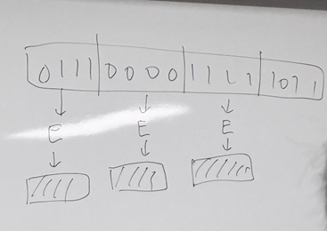

- 긴 평문을 일정한 길이의 블록(덩어리)으로 나누어 블록단위 암호화하는 방식
- 데이터가 다 들어와야 암호화 가능
- DES, AES 등

### stream

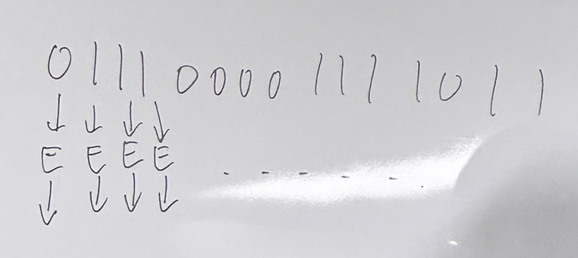

- stream: 개울, 시내
- 쉬지 않고 계속 흘러가는 것
- bit 혹은 byte 단위로 암호화
- 데이터가 오는대로 바로 암호화해서 보내는 것
- eStrea, RC4 등

### block vs. stream

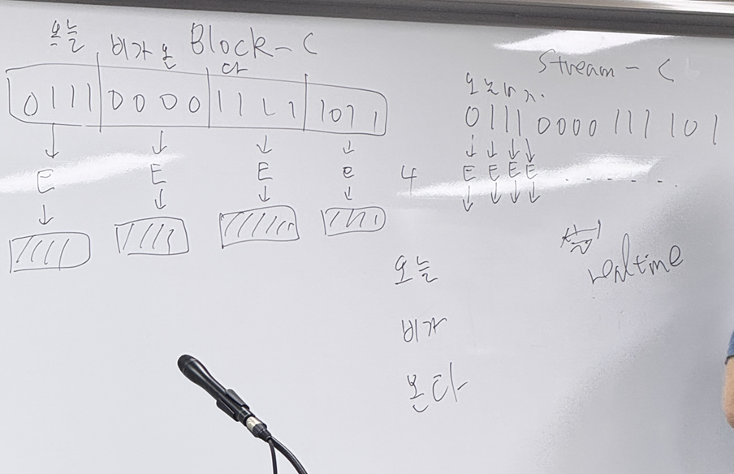

- block

  - cpu와 ram을 적게 쓰니 좋고, 속도도 stream보다 빠르지만
  - 블록이 채워질 때까지 보내지 않음.
  - 사진, 영상 파일은 데이터가 블록채로 한번에 들어오니 block cipher 사용

- stream
  - **실시간(real time)**으로 보내야 할 때 좋음.
  - 예: 실시간 방송, 카톡 글 보낼 때 좋음.

## block cipher

- 긴 평문을 일정한 길이의 블록으로 나누어 블록단위로 암호화하는 방식
- 속도를 빠르게 하고, 메모리를 아끼려고
- sw 구현이 쉽다.
- Round를 사용하여 반복적으로 암호화하므로 안전
- 대부분 Feistel cipher structure 기반
- DES, AES 등

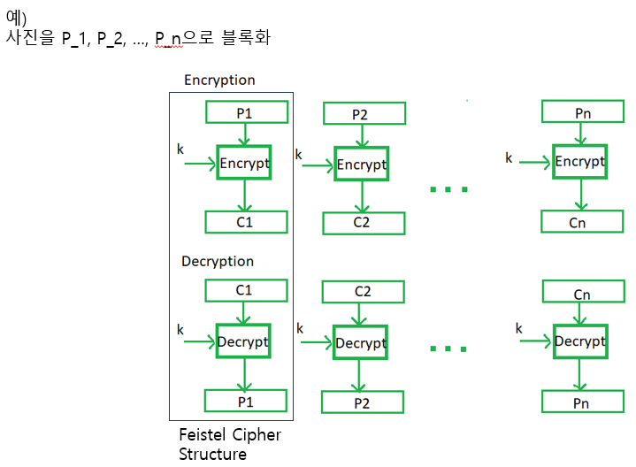

### Feistel Cipher Structure란?

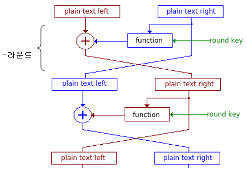

- 대부분 block cipher에 사용
- 입력 block을 반으로 나눈다.
- 왼쪽, 오른쪽으로 바꿔가며 여러 Round 수행

### Feistel Cipher Parameters

- block size
- key size
- round
- function의 복잡도
  => 크면 안전해지지만 느려짐

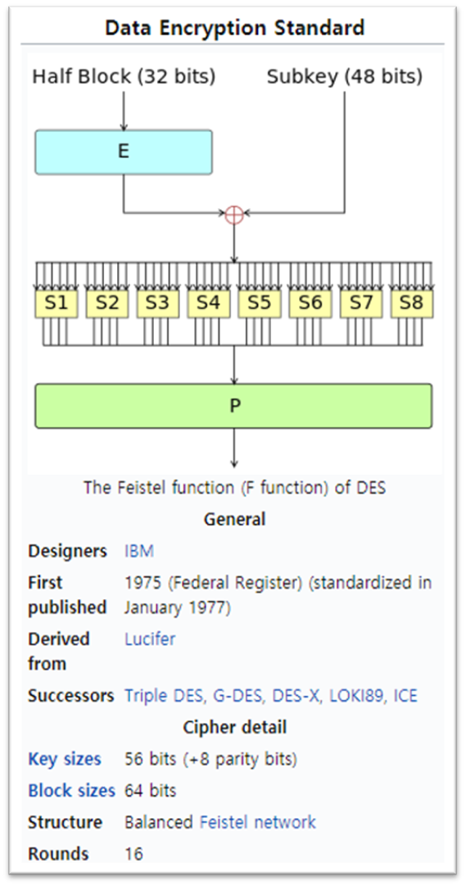

### DES(Data Encryption Standard)

(데이터 암호 표준)

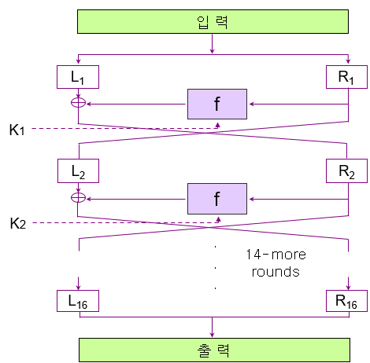

- 가장 많이 쓰임
- Feistel Cipher Structure
- block size: 64bits
- key size: 56bits
- 16 Round
- 변형 버전: 2DES, 3DES

  - 2DES: 2개 key 사용
    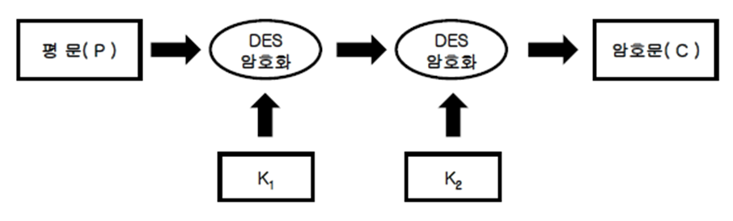

  - 3DES: 2~3개 key로 3회 암복호화
    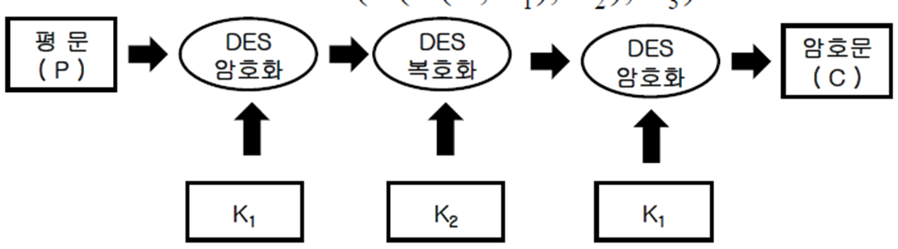

```
from Crypto.Cipher import DES

key = b'12345678' # 8 bytes
iv = b'12345678'
cipher1 = DES.new(key, DES.MODE_CFB, iv)

msg = input("plaintext : ")
plaintext = bytes(msg, 'utf-8')
ciphertext = cipher1.encrypt(plaintext)
print('ciphertext : ',ciphertext)

cipher2 = DES.new(key, DES.MODE_CFB, iv)
print("decrypting ... ", cipher2.decrypt(ciphertext))
```

### AES(Advanced Encryption Standard)

(향상된 암호 표준)

- Feistel Cipher Structure
- block size: 128bits
- key size: 128, 192, 256bits
- 10, 12, 14 Round
- Rijndael 표준 선정

```
from Crypto.Cipher import AES

key = b'sunsunsunsunsuns'  # 16 bytes
cipher1 = AES.new(key, AES.MODE_EAX)

nonce = cipher1.nonce

msg = input("plaintext : ")
plaintext = bytes(msg, 'utf-8')
ciphertext = cipher1.encrypt(plaintext)
print('ciphertext : ',ciphertext)

cipher2 = AES.new(key, AES.MODE_EAX, cipher1.nonce)
print("decrypting ... ", cipher2.decrypt(ciphertext))
```
